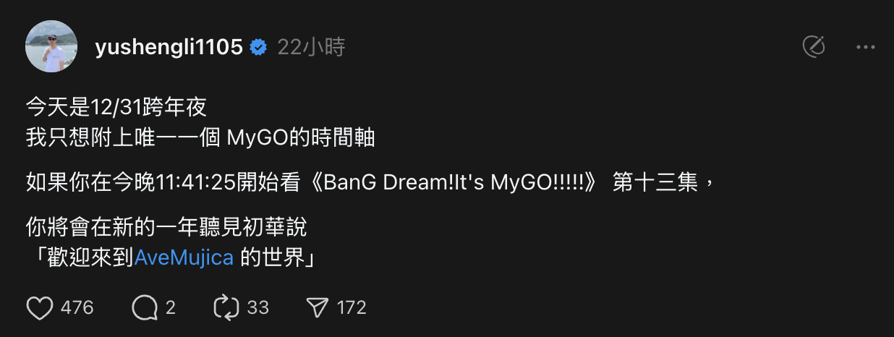

# Video Time Sync Script

A userscript that synchronizes video playback with real-world time. Perfect for coordinating watch parties or timing specific moments with exact timestamps.

## Installation

1. Install a userscript manager (like Tampermonkey) for your browser
2. [Click here to install](https://github.com/JacobLinCool/2024-final-project-video-sync/raw/refs/heads/main/dist/index.user.js)

## Current Support

Currently only works for:

- Bahamut Anime (巴哈姆特動畫瘋) BanG Dream! It's MyGO!!!!! Episode 13 (https://ani.gamer.com.tw/animeVideo.php?sn=34714)

## Technical Details

This script is configured to:

- Target time: 2025-01-01 00:00:00
- Video timestamp: 18:35
- Tolerance: 0.5 seconds

## Inspiration

This project was inspired by a post on threads.net:

> 如果你在今晚11:41:25開始看《BanG Dream!It's MyGO!!!!!》 第十三集，
> 你將會在新的一年聽見初華說
> 「歡迎來到AveMujica 的世界」
>
> -- yushengli1105 on threads.net

Built in the last coding hour of 2023 to bring a little more fun to synchronized video watching!

## License

MIT
